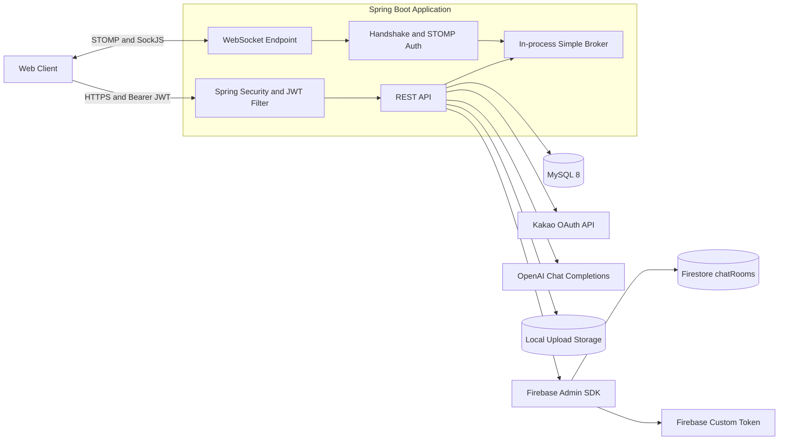
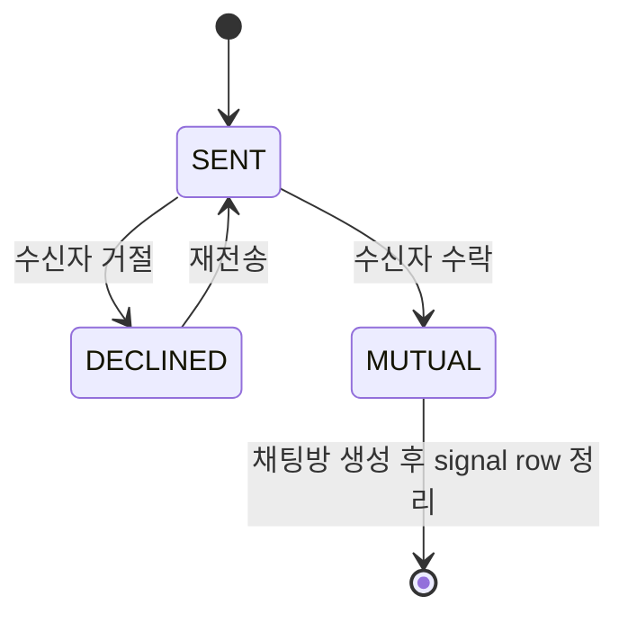
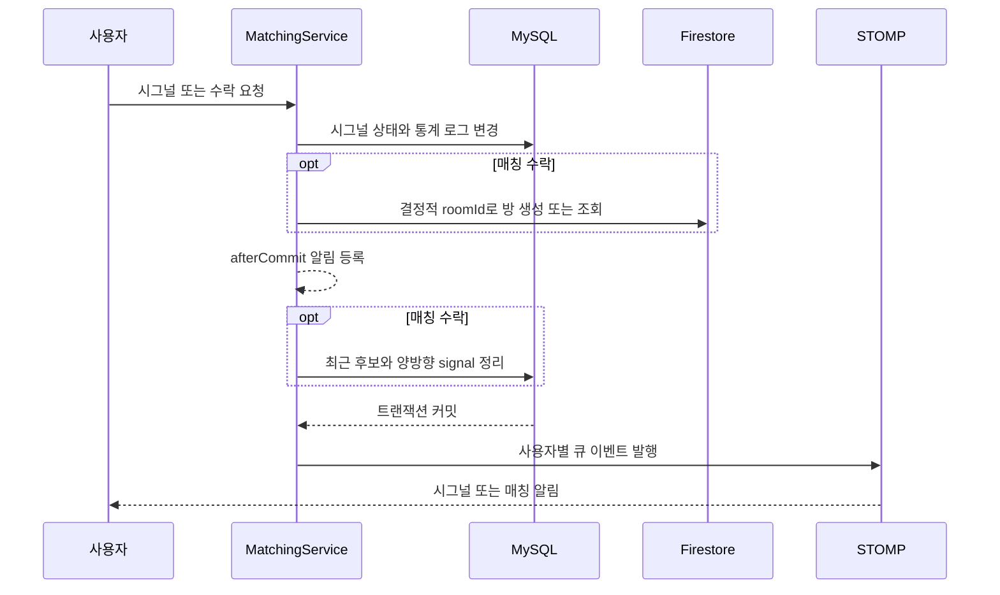

<div align="center">


# 너랑나랑 (UNME)

### 한서대학교 축제에서 실제 운영한 교내 소개팅·매칭 서비스

**Backend Portfolio · Spring Boot · MySQL · Firestore · JWT · STOMP**

</div>

<p align="center">
  
</p>

---

## 프로젝트 한눈에 보기

| 항목 | 내용 |
|---|---|
| 프로젝트 | 한서대학교 학생을 대상으로 축제 기간 운영한 소개팅·매칭 웹 서비스 |
| 담당 | **Backend Developer 박찬우** — API, 인증, 도메인 모델, 데이터 저장, 외부 연동, 실시간 알림 |
| 개발 | 2025년 9월 |
| 실제 운영 | 2025.09.29 ~ 2025.10.03 |
| 운영 성과 | **누적 사용자 1,200명 이상** — 운영 기록 기준 |
| 핵심 흐름 | 카카오 로그인 → 프로필·성향 입력 → 후보 추천 → 시그널 → 상호 수락 → 1:1 채팅 |
| 저장소 | MySQL은 사용자·크레딧·성사 전 시그널, Firestore는 성사 후 채팅방 관리 |

> 기능 수를 늘리는 것보다, 같은 후보의 반복 노출·쿠폰 중복 사용·중복 채팅방·트랜잭션 롤백 전 알림처럼 운영 흐름에서 발생할 수 있는 상태 불일치를 서버 규칙으로 통제하는 데 집중했습니다.

## 프로젝트 배경

대학교에서는 새로운 사람을 만나고 싶어도 같은 학과나 활동 범위 안에서 관계가 형성되는 경우가 많습니다. 너랑나랑은 한서대학교 축제라는 공통된 맥락 안에서 사용자가 가볍게 참여하고, 서로 관심이 있을 때만 대화로 이어질 수 있도록 기획한 서비스입니다.

사용자는 카카오 로그인 후 프로필과 10문항 성향 검사를 입력합니다. 서버는 동일 학과·과거 노출·기존 시그널·기존 채팅방을 고려해 후보를 선별하고, 상대가 시그널을 수락했을 때만 Firestore 1:1 채팅방을 엽니다. 축제 부스에서 제공한 1회성 쿠폰은 서비스의 매칭·시그널 크레딧으로 연결했습니다.

## 실제 운영 성과

- 2025년 9월 29일부터 30일까지 한서대학교 축제 부스와 함께 서비스 운영
- 음료 구매자에게 1회성 쿠폰을 제공해 오프라인 이벤트와 온라인 서비스를 연결
- 운영 기록 기준 누적 사용자 **1,200명 이상**
- 사용자 요청으로 운영 기간을 2025년 10월 3일까지 연장
- 한서대학교 홍보 시스템 `자미원` 2025년 11월호 소개

<table>
  <tr>
    <td width="50%" valign="top">
      
      <br /><sub><strong>축제 부스 운영</strong></sub>
    </td>
    <td width="50%" valign="top">
      
      <br /><sub><strong>자미원 서비스 소개</strong></sub>
    </td>
  </tr>
</table>

성과 수치는 동시 접속자나 TPS가 아닌 누적 사용자 기록입니다. 별도의 부하 테스트 수치가 없으므로 성능을 과장하지 않고, 실제 배포·사용자 피드백·운영 연장 경험 자체를 성과로 구분했습니다.

## 백엔드 담당 범위

| 영역 | 담당 내용 |
|---|---|
| 인증·계정 | Kakao OAuth 연동, Access/Refresh JWT, HttpOnly Cookie, 탈퇴 계정의 HTTP·신규 STOMP 인증 차단 |
| 사용자 | 온보딩 검증, 프로필 수정, 성향 결과 저장, 탈퇴 상태 및 채팅 표시 마스킹 |
| 매칭 | 후보 조회 규칙, 재노출 방지, 크레딧 차감, 최근 추천 결과 관리 |
| 시그널 | 발신·수락·거절 상태, 권한 검사, 매칭 성사 처리, 낙관적 락 |
| 채팅 연동 | 결정적 roomId, Firestore `chatRooms`, 상대 프로필 미러 동기화 |
| 실시간 | STOMP 연결 인증, 사용자별 시그널·매칭 큐, DB 커밋 이후 이벤트 발행 |
| 이벤트·통계 | 1회성 축제 쿠폰, 신호·매칭 시점 스냅샷 로그, 학과·MBTI 랭킹 |
| 외부 연동 | Kakao, OpenAI, Firebase Admin·Firestore, Web Push 기반 |
| 파일 | 로컬 이미지 업로드·정적 리소스 제공 기반 |

Controller 매핑 기준 29개의 HTTP 엔드포인트를 구현했지만, 이 문서에서는 요청·응답 전문보다 백엔드 설계 판단과 문제 해결 과정을 중심으로 설명합니다.

## 서비스 흐름

1. 카카오 OAuth로 로그인하고 Access/Refresh JWT를 발급합니다.
2. 프로필과 10문항 A/B 답변을 검증·저장하고 성향 설명을 생성합니다.
3. 활성 상태·프로필 완료·반대 성별·타 학과·미노출 조건으로 후보를 조회합니다.
4. 기존 시그널과 Firestore 채팅방까지 제외한 뒤 최대 3명을 반환합니다.
5. 사용자가 시그널을 보내고 상대가 수락하면 매칭 로그와 채팅방을 생성합니다.
6. DB 커밋 이후 양쪽 사용자의 STOMP 큐로 이벤트를 발행합니다.

<table>
  <tr>
    <td width="50%" valign="top">
      
      <br /><sub><strong>후보 추천</strong> — 프로필 카드</sub>
    </td>
    <td width="50%" valign="top">
      
      <br /><sub><strong>후보 추천</strong> — 성향 정보</sub>
    </td>
  </tr>
  <tr>
    <td width="50%" valign="top">
      
      <br /><sub><strong>시그널 응답</strong> — 수락</sub>
    </td>
    <td width="50%" valign="top">
      
      <br /><sub><strong>시그널 응답</strong> — 거절</sub>
    </td>
  </tr>
  <tr>
    <td width="50%" valign="top">
      
      <br /><sub><strong>매칭 후 채팅</strong> — 채팅방 목록</sub>
    </td>
    <td width="50%" valign="top">
      
      <br /><sub><strong>매칭 후 채팅</strong> — 1:1 대화</sub>
    </td>
  </tr>
</table>

## 백엔드 아키텍처



### 저장소별 책임

| 저장소 | 소유 데이터 | 선택 이유 | 현재 트레이드오프 |
|---|---|---|---|
| MySQL | 사용자, 크레딧, 성사 전 시그널, 노출 이력, 쿠폰, 통계 이벤트 | 제약조건·트랜잭션·집계가 필요한 도메인 | `ddl-auto=update` 의존, 스키마 버전 관리 필요 |
| Firestore | 성사 후 채팅방 존재, 참여자, 상대 카드, 목록용 미러 | 클라이언트가 실시간으로 소비하는 채팅 데이터 | MySQL과 분산 원자성이 없음 |
| In-process STOMP Broker | 시그널·매칭 실시간 이벤트 | 사용자별 큐를 빠르게 구성 | 단일 프로세스 기반, 재시도·영속성 없음 |
| Local Filesystem | 프로필·유형 이미지 | 짧은 이벤트 운영에 단순한 구성 | 수평 확장과 보안 강화를 위해 Object Storage 전환 필요 |

MySQL은 사용자·크레딧·성사 전 시그널을, Firestore는 성사 후 채팅방 존재와 메타데이터를 관리합니다. `match_logs`는 현재 관계 상태가 아니라 성사 시점의 통계 이벤트입니다. 이 분리는 구현 속도와 실시간 소비에는 유리했지만 두 저장소를 하나의 트랜잭션으로 묶지는 못하므로, 교차 저장소 장애에 대한 outbox·보상 처리가 필요합니다.

## 핵심 문제 해결

### 1. 같은 후보가 반복 노출되고 크레딧만 차감되는 문제

#### 문제

단순 무작위 조회만 사용하면 이미 본 사용자, 이미 시그널을 보낸 사용자, 이미 채팅방이 있는 사용자가 다시 노출될 수 있습니다. 후보가 없는 상황에서도 크레딧이 차감되면 사용자는 결과 없이 사용 기회만 잃습니다.

#### 설계

후보 선별을 DB 조건과 서비스 조건으로 나눴습니다.

> `반대 성별 → 프로필 완료 → 활성 계정 → 본인 제외 → 타 학과 → 미노출 → 미발신 → 채팅방 없음 → 무작위 최대 3명`

- JPQL에서 성별·학과·프로필 완료·탈퇴·본인·과거 노출 조건을 먼저 필터링합니다.
- 서비스에서 기존 시그널과 Firestore 채팅방 존재 여부를 추가 확인합니다.
- 반환할 후보가 있을 때만 `seen_candidates`를 저장하고 매칭 크레딧을 1 차감합니다.
- `(viewer_id, seen_user_id)` 유니크 제약으로 애플리케이션 밖에서도 중복 기록을 방어합니다.
- `User.version`으로 동시에 갱신되는 크레딧 충돌을 감지합니다.

#### 결과와 한계

결과가 없는 요청의 크레딧을 보존하고, 동일 후보가 이후 추천에 다시 포함되지 않도록 만들었습니다. 다만 후보 전체를 메모리에서 섞고 후보별로 Firestore를 동기 조회하므로, 사용자 규모가 커지면 배치 조회나 MySQL 측 매칭 미러로 외부 왕복 횟수를 줄여야 합니다. 노출 이력의 만료·초기화 정책도 현재는 없습니다.

**구현 근거**

- [UserCandidateRepository](src/main/java/com/example/uni/user/repo/UserCandidateRepository.java)
- [MatchingService.requestMatch](src/main/java/com/example/uni/match/MatchingService.java)
- [SeenCandidate](src/main/java/com/example/uni/match/SeenCandidate.java)
- [User](src/main/java/com/example/uni/user/domain/User.java)

### 2. 시그널 상태와 채팅방 중복 생성 문제

#### 문제

시그널 발신·거절·수락을 단순 Boolean으로 관리하면 누가 어떤 행동을 했는지 표현하기 어렵습니다. 수락 요청이 반복되거나 양방향 시그널이 존재할 때 임의의 채팅방 ID를 사용하면 같은 사용자 쌍에 여러 방이 생길 수 있습니다.

#### 설계

- 방향성이 있는 `(sender, receiver)` 쌍을 유니크 제약으로 관리합니다.
- 서비스 계층의 현재 상태 조건으로 허용된 전이만 수행하고, `@Version`으로 동시 갱신 충돌을 감지합니다.
- 거절 시 레코드를 즉시 삭제하지 않고 `receiver_deleted_at`으로 수신자 목록에서만 숨깁니다.
- 수락 시 양쪽의 ID·학과·정규화된 MBTI를 `match_logs`에 남기고 Firestore 채팅방을 생성합니다.
- 두 사용자 ID를 정렬한 `r_{minId}_{maxId}`를 문서 ID로 사용해 동일 사용자 쌍이 같은 문서로 수렴하게 합니다.



#### 결과와 한계

발신자와 수신자의 UI 상태를 분리하고, 같은 사용자 쌍이 동일한 Firestore 문서 ID로 수렴하도록 만들었습니다. 수락 처리 중 신호를 `MUTUAL`로 전환한 뒤 양방향 신호 행을 정리하며, `match_logs`에는 관계의 현재 상태가 아닌 성사 시점의 통계 이벤트만 남깁니다. 거절 후 재전송은 기존 레코드를 다시 활성화하고 현재 크레딧을 재차감하지 않으므로, 이 정책은 명시적인 제품 규칙과 회귀 테스트가 더 필요합니다.

**구현 근거**

- [Signal](src/main/java/com/example/uni/match/Signal.java)
- [MatchingService.acceptSignal](src/main/java/com/example/uni/match/MatchingService.java)
- [ChatRoomService](src/main/java/com/example/uni/chat/ChatRoomService.java)

### 3. 축제 쿠폰의 중복 사용 문제

#### 문제

오프라인 부스에서 배포한 쿠폰은 한 번만 사용할 수 있어야 합니다. 코드를 먼저 조회하고 나중에 `used=true`로 변경하면 동시에 들어온 두 요청이 모두 미사용 상태를 읽을 수 있습니다.

#### 설계

`used=false`인 코드만 갱신하는 조건부 UPDATE를 먼저 수행하고, 영향받은 행 수로 사용 성공 여부를 판정했습니다. 성공한 요청은 같은 MySQL 트랜잭션에서 매칭·시그널 크레딧을 각각 5개 증가시킵니다.

```sql
update verify_code
set used = true, used_at = :now
where upper(code) = :code
  and used = false
```

#### 결과와 한계

미사용 상태를 먼저 선점한 요청만 크레딧을 받을 수 있도록 만들어 한 코드의 중복 사용을 제어했습니다. 현재 모델에는 만료 시각이 없으므로 구현된 규칙은 ‘존재하며 아직 사용되지 않은 코드’입니다. 기간 제한이 필요하다면 `expires_at`과 발급·회수 정책을 추가해야 합니다.

**구현 근거**

- [VerifyCodeRepository](src/main/java/com/example/uni/event/VerifyCodeRepository.java)
- [EventService](src/main/java/com/example/uni/event/EventService.java)

<p align="center">
  
</p>

### 4. DB 롤백 전에 실시간 알림이 먼저 도착하는 문제

#### 문제

시그널이나 매칭 상태가 MySQL에 반영됐더라도 커밋 전에 WebSocket 알림을 보내면, 이후 트랜잭션이 롤백됐을 때 클라이언트에는 성공 이벤트만 남을 수 있습니다.

#### 설계

`TransactionSynchronization.afterCommit()`에 알림 작업을 등록하는 `AfterCommitExecutor`를 만들었습니다. 신호 발송·거절·매칭 성사의 사용자별 STOMP 알림은 MySQL 커밋이 완료된 뒤에만 실행됩니다.



#### 결과와 한계

롤백된 MySQL 상태에 대한 알림이 먼저 노출되는 문제를 줄였습니다. 그러나 매칭 수락에서는 Firestore 쓰기가 MySQL 커밋보다 먼저 수행되어 두 저장소의 원자성을 보장하지 못합니다. 또한 broker와 callback이 영속적이지 않고 알림 예외가 커밋 후 HTTP 응답에 영향을 줄 수 있어, 전달 보장이 필요한 규모에서는 Transactional Outbox·보상 처리·외부 메시지 브로커가 필요합니다.

**구현 근거**

- [AfterCommitExecutor](src/main/java/com/example/uni/common/domain/AfterCommitExecutor.java)
- [RealtimeNotifier](src/main/java/com/example/uni/common/realtime/RealtimeNotifier.java)
- [MatchingService](src/main/java/com/example/uni/match/MatchingService.java)

## 그 밖의 설계 판단

| 영역 | 구현 판단 | 현재 경계와 개선점 | 구현 근거 |
|---|---|---|---|
| 탈퇴 계정 | JWT 검증 후 활성 상태를 조회해 HTTP 요청과 신규 STOMP 연결을 차단하고, Firestore 상대 카드를 탈퇴 사용자로 마스킹 | 이미 연결된 WebSocket 세션은 강제로 종료하지 않으며, 일부 식별값은 재가입 차단을 위해 유지하므로 완전 익명화가 아님 | [JwtAuthFilter](src/main/java/com/example/uni/auth/JwtAuthFilter.java), [StompAuthChannelInterceptor](src/main/java/com/example/uni/common/config/StompAuthChannelInterceptor.java), [OAuthService](src/main/java/com/example/uni/auth/OAuthService.java) |
| 성향 설명 | 규칙 기반 `typeId`와 OpenAI 설명 생성을 분리하고, HTTP 오류·빈 응답·파싱 실패 시 기본 설명과 EGEN/TETO 규칙으로 저장을 계속 | `OPENAI_API_KEY`는 애플리케이션 시작에 필요하며 호출이 DB 트랜잭션 안에서 동기 수행됨. timeout·retry·circuit breaker와 트랜잭션 밖 실행 필요 | [UserService.completeProfile](src/main/java/com/example/uni/user/service/UserService.java), [GptTextGenClient](src/main/java/com/example/uni/user/ai/GptTextGenClient.java) |
| 통계 스냅샷 | 이벤트 발생 시점의 학과·MBTI를 `signal_logs`, `match_logs`에 저장해 이후 프로필 변경과 통계를 분리 | 최초 전송과 `DECLINED → SENT` 재전송은 각각 집계하지만, 아직 `SENT`인 신호의 중복 호출은 추가 집계하지 않음. 매칭 한 건은 양쪽 참여자를 각각 계산 | [SignalLog](src/main/java/com/example/uni/rank/SignalLog.java), [MatchLog](src/main/java/com/example/uni/rank/MatchLog.java) |

## 데이터 모델

<p align="center">
  
</p>

| 테이블 | 책임 | 주요 제약·설계 |
|---|---|---|
| `users` | OAuth 계정, 프로필, 크레딧, 성향, 탈퇴 상태 | Kakao ID·이메일·서비스 이름 unique, `@Version` |
| `signals` | 방향성 있는 시그널 상태 | `(sender_id, receiver_id)` unique, 상태 인덱스, `@Version` |
| `seen_candidates` | 사용자별 후보 노출 이력 | `(viewer_id, seen_user_id)` unique |
| `verify_code` | 축제 1회성 쿠폰 | 코드 unique, 조건부 UPDATE로 사용 선점 |
| `signal_logs` | 시그널 시점의 상대 학과·MBTI | 현재 프로필과 분리된 통계 스냅샷 |
| `match_logs` | 성사 시점의 양쪽 학과·MBTI | 양쪽 참여자를 `UNION ALL`로 집계 |
| `push_subscriptions` | 사용자별 Web Push 구독 | 사용자 ID unique, 현재 이벤트 연결은 미완료 |

Firestore의 `chatRooms`는 MySQL Entity가 아닙니다. 정렬된 사용자 ID로 만든 roomId, 참여자, 사용자별 상대 카드인 `peers`, 목록 조회용 `listCard`, 생성 시각을 저장합니다.

## 대표 API 경계

기본 context path는 `/api`이며, 인증·파일·유형 이미지처럼 Security 설정에 명시한 공개 경로를 제외한 주요 API는 Bearer Access Token을 요구합니다. 현재 파일 관련 공개 범위는 아래 개선 우선순위에 별도로 기록했습니다.

| 도메인 | 대표 엔드포인트 | 책임 |
|---|---|---|
| Auth | `GET /api/auth/kakao/login`, `POST /api/auth/refresh`, `GET /api/auth/me` | OAuth 로그인, 토큰 재발급, Firebase Custom Token |
| User | `PUT /api/users/me/profile`, `GET /api/users/{userId}` | 온보딩·내 프로필·상대 프로필 |
| Match | `POST /api/match/start`, `GET /api/match/previous` | 후보 추천과 직전 결과 조회 |
| Signal | `POST /api/signals/{targetId}`, `POST /api/signals/accept/{signalId}` | 시그널 상태와 매칭 성사 |
| Event | `POST /api/event/redeem` | 1회성 쿠폰 사용과 크레딧 지급 |
| Stats | `GET /api/stats/rank/*` | 학과·MBTI별 신호·매칭 이벤트 집계 |
| File | `POST /api/files/upload`, `GET /api/files/**` | 이미지 저장과 정적 파일 제공 |

관련 진입점은 [AuthController](src/main/java/com/example/uni/auth/AuthController.java), [UserController](src/main/java/com/example/uni/user/controller/UserController.java), [MatchingController](src/main/java/com/example/uni/match/MatchingController.java), [EventController](src/main/java/com/example/uni/event/EventController.java), [MatchStatsController](src/main/java/com/example/uni/rank/MatchStatsController.java)에서 확인할 수 있습니다.

## 기술 스택과 선택 이유

| 구분 | 기술 | 적용 이유 |
|---|---|---|
| Language | Java 21 | 최신 Java 문법과 장기 지원 버전 사용 |
| Framework | Spring Boot 3.5.5 | MVC, Security, Validation, JPA, WebSocket 통합 |
| Persistence | MySQL 8, Spring Data JPA | 핵심 상태의 트랜잭션·제약조건·집계 쿼리 |
| Security | Spring Security, JJWT 0.11.5 | Stateless API 인증과 Access/Refresh 타입 구분 |
| Chat | Firebase Admin SDK, Firestore | 채팅방 메타데이터와 Firebase Custom Token 연동 |
| Realtime | STOMP, SockJS, SimpMessagingTemplate | 시그널·매칭 이벤트를 사용자별 큐로 전송 |
| External API | Kakao OAuth, OpenAI, WebClient | 로그인과 성향 설명 생성 |
| File | Multipart, Local Filesystem | 이벤트 운영 단계의 단순한 이미지 저장 |
| Build | Gradle 8.14.3 | Java 21 toolchain과 의존성 관리 |

## 검증 상태와 기술 부채

### 현재 확인된 상태

- Java 21 환경에서 메인 소스 `compileJava` 성공
- JPA Entity와 수동 ERD 기준 7개 MySQL 테이블 구조 확인
- 도메인 동작은 실제 축제 운영을 통해 사용됐지만, 운영 당시의 부하·지연·가용성 지표는 남아 있지 않음
- 자동화 테스트는 `contextLoads` 1건뿐이고 현재 실패함. 별도 test profile 없이 설정된 MySQL에 연결해 `ddl-auto=update`를 시도한 뒤 `${kakao.admin-key}` 미설정으로 컨텍스트 로딩 실패

### 운영 이후 코드 리뷰에서 확인한 개선 우선순위

| 우선순위 | 현재 한계 | 다음 개선 |
|---|---|---|
| P0 | 테스트가 기본 MySQL·Firebase·필수 설정에 결합되어 있음 | Testcontainers MySQL, 외부 연동 대역, 도메인 단위·통합 테스트, CI 구축 |
| P0 | `ddl-auto=update`와 수동 배포에 의존해 스키마·환경 재현성이 부족함 | 환경별 profile, Flyway, 운영 `ddl-auto=validate`, 재현 가능한 배포 파이프라인 |
| P0 | 파일·유형 이미지 공개 업로드와 상대 상세 조회의 인가·필드 최소화가 부족함 | 역할·관계 기반 인가, 실제 파일 시그니처 검증, 응답·경로 최소화, Object Storage |
| P1 | MySQL 커밋 전에 Firestore·Kakao 작업이 수행되고 STOMP 전달이 비영속적임 | Transactional Outbox, 보상·재시도 정책, 외부 메시지 브로커 |

한계를 숨기기보다, 실제 운영 이후 코드를 다시 검토해 다음 설계에서 우선 해결해야 할 문제로 정리했습니다.

## 로컬 실행

<details>
<summary><strong>필수 조건과 실행 방법 보기</strong></summary>

### 필수 조건

- JDK 21
- 접근 가능한 MySQL 8 데이터베이스
- Kakao OAuth 애플리케이션과 Admin Key
- 유효한 Firebase Service Account JSON
- OpenAI API Key와 VAPID Key Pair — 현재 설정에서는 시작 시 필수
- 쓰기 가능한 업로드 디렉터리

### 주요 환경변수

실제 비밀값은 저장소나 README에 기록하지 않습니다.

| 환경변수 | 구분 | 용도 |
|---|---|---|
| `SPRING_DATASOURCE_URL`, `SPRING_DATASOURCE_USERNAME`, `SPRING_DATASOURCE_PASSWORD` | 환경별 필수 | MySQL 연결 정보 |
| `JWT_SECRET` | 운영 필수 | HS256 서명 키. 저장소 기본값을 운영에서 사용하면 안 됨 |
| `KAKAO_CLIENT_ID`, `KAKAO_ADMIN_KEY`, `KAKAO_REDIRECT_URI` | 기능 필수 | OAuth 로그인·콜백·연결 해제 |
| `KAKAO_CLIENT_SECRET` | 선택 | Secret을 사용하는 Kakao 애플리케이션에서 설정 |
| `FIREBASE_CREDENTIALS`, `FIREBASE_PROJECT_ID` | 환경별 필수 | Service Account JSON 경로와 프로젝트 ID |
| `OPENAI_API_KEY` | 현재 필수 | 성향 설명 생성. API 오류 응답은 fallback하지만 키 누락 시 시작 실패 |
| `VAPID_PUBLIC`, `VAPID_PRIVATE` | 현재 필수 | Web Push 키 |
| `APP_UPLOAD_DIR`, `APP_PUBLIC_BASE_URL` | 환경별 필수 | 업로드 디렉터리와 외부 공개 API 주소 |
| `CORS_ALLOWED_ORIGINS`, `WS_ALLOWED_ORIGINS` | 환경별 필수 | 허용 Web·WebSocket Origin 목록 |
| `AUTH_COOKIE_DOMAIN`, `AUTH_COOKIE_SECURE`, `AUTH_COOKIE_SAME_SITE` | 환경별 필수 | Refresh Cookie 정책 |

### 실행

Windows:

```powershell
.\gradlew.bat bootRun
```

macOS/Linux:

```bash
bash ./gradlew bootRun
```

서버 기본 포트는 `8080`, context path는 `/api`입니다. 로컬 HTTP 환경에서는 운영용 Cookie Domain·Secure·SameSite 설정을 반드시 로컬 값으로 덮어써야 합니다.

> 현재 별도 test profile이 없고 `ddl-auto=update`가 기본 설정입니다. 격리된 테스트 DB와 외부 연동 대역을 준비하기 전에는 `gradlew test`가 로컬 DB 스키마에 영향을 줄 수 있습니다.

</details>

## 회고

이 프로젝트를 통해 백엔드는 API를 나열하는 역할이 아니라, 사용자 행동을 유효한 상태 전이로 제한하고 여러 저장소·외부 시스템 사이의 실패 경계를 설계하는 역할이라는 점을 배웠습니다.

실제 운영 흐름을 설계하고 운영 이후 코드를 다시 검토하면서 같은 후보의 재노출, 결과 없는 크레딧 차감, 중복 쿠폰 사용, 탈퇴 사용자 표시, 알림 순서처럼 사용자 경험에 영향을 줄 수 있는 위험을 식별했습니다. 이를 제약조건, 조건부 갱신, 결정적 식별자, 커밋 후 이벤트로 통제하면서 도메인 규칙을 코드와 데이터 모델 양쪽에 배치하는 경험을 했습니다.

동시에 테스트 격리, 스키마 마이그레이션, 업로드 인가, 교차 저장소 정합성처럼 짧은 이벤트 운영을 우선한 선택이 남긴 기술 부채도 확인했습니다. 다음 프로젝트에서는 운영 이후가 아니라 설계 초기부터 테스트 가능한 외부 연동 경계와 재현 가능한 배포·마이그레이션 체계를 함께 구성하는 것이 목표입니다.
